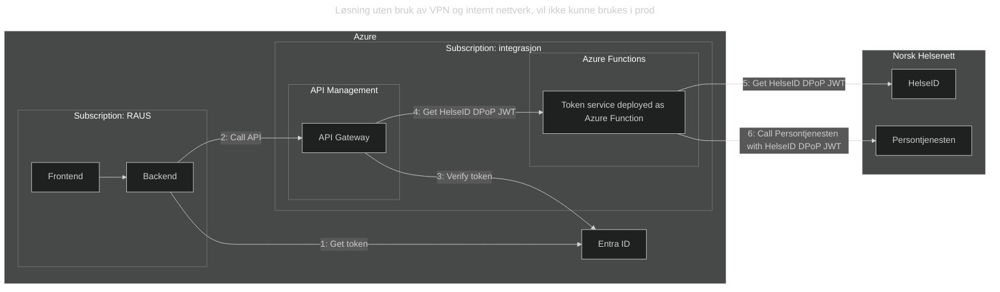

Persontjenesten uten å gå via internt nettverk:

```mermaid
---
title: Løsning uten bruk av VPN og internt nettverk, vil ikke kunne brukes i prod
config:
    theme: dark
---
flowchart LR
    backend -->|1: Get token| entraid
    backend -->|2: Call API| apigateway
    apigateway -->|3: Verify token| entraid
    apigateway -->|4: Get HelseID DPoP JWT | tokenservice
    tokenservice -->|5: Get HelseID DPoP JWT| helseId
    tokenservice -->|6: Call Persontjenesten with HelseID DPoP JWT| persontjenesten
    
    subgraph azure[Azure]
        entraid[Entra ID]
        subgraph integrasjon[Subscription: integrasjon]
            subgraph apimanagement[API Management]
                apigateway[API Gateway]
            end

            subgraph functions[Azure Functions]
                tokenservice[Token service deployed as Azure Function]
            end
        end

        subgraph raus[Subscription: RAUS]
            frontend[Frontend]
            backend[Backend]
            frontend --> backend
        end

    end

    subgraph nhn[Norsk Helsenett]
        persontjenesten[Persontjenesten]
        helseId[HelseID]
    end
```
